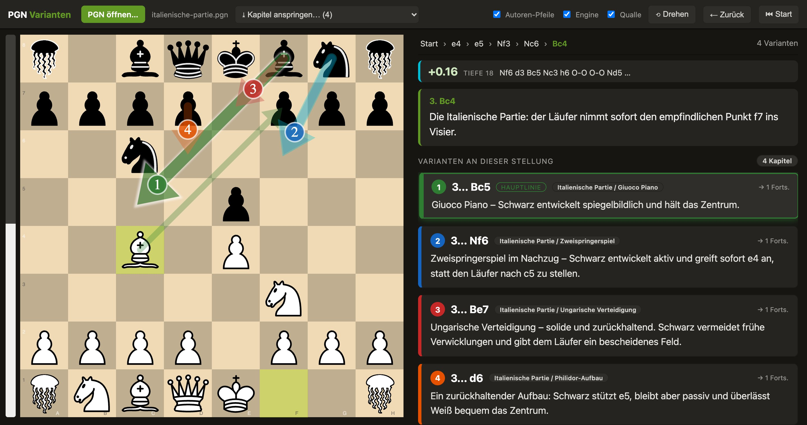

# PGN-Varianten-Brett

Eine statische, komplett offline laufende HTML-Seite zum Durchspielen von Schach-PGNs,
bei der **alle Varianten einer Stellung gleichzeitig** als nummerierte Pfeile aufs Brett
gezeichnet werden und die zugehörigen **Kommentare groß nebeneinander** rechts stehen.



*(Beispiel mit der mitgelieferten [`examples/italienische-partie.pgn`](examples/italienische-partie.pgn).)*

## Benutzen
**Online:** läuft direkt im Browser über GitHub Pages:
<https://kechel.github.io/pgn-varianten/>

**Lokal:** einfach **`index.html` im Browser öffnen** (Doppelklick). Kein Server nötig.

- Oben **„PGN öffnen…"** klicken oder eine `.pgn` ins Fenster ziehen.
- Enthält die Datei mehrere Partien/Kapitel, oben im Dropdown anspringen. Kapitel, die
  über dieselbe Stellung laufen, werden zu einem gemeinsamen Zugbaum zusammengeführt;
  bei Zugumstellungen werden die Kommentare aller passenden Kapitel mit angezeigt.
- Jede mögliche Fortsetzung der aktuellen Stellung wird als **nummerierter Pfeil**
  gezeichnet (Hauptlinie grün = 1), rechts steht zu jeder Variante der PGN-Kommentar
  samt Kapitel.
- **Variante wählen:** `↑`/`↓` (die gewählte wird hervorgehoben), `→` oder `Enter` folgt
  ihr · Taste `1`–`9` wählt direkt · oder eine **Karte anklicken**.
- **Navigation:** `←` / `Backspace` zurück · `Home` Start · die **Breadcrumb-Leiste oben**
  im rechten Bereich anklicken springt an jede Stelle.
- **Figuren mit der Maus ziehen** geht auch — passt der Zug zu einer Variante, wird ihr
  gefolgt; sonst frei weiterspielen (außerhalb der PGN).
- **„Drehen"** (`f`) dreht das Brett, **„Autoren-Pfeile"** blendet die in der PGN
  hinterlegten `[%cal]`/`[%csl]`-Markierungen des Autors ein/aus.
- **„Qualle"** (default an) zeigt die Türme als Quallen-Icon; ausgeschaltet die
  normalen cburnett-Türme.
- **„Engine"** schaltet eine lokale **Stockfish**-Bewertung der aktuellen Stellung ein:
  Eval-Balken links am Brett (Weiß füllt von unten), Bewertung + Tiefe + beste Linie
  rechts, bester Zug als türkisfarbener Pfeil. Bewertet automatisch bei jeder Navigation
  neu, auch nach eigenen (Off-Book-)Zügen. Läuft komplett offline im Browser (**default an**;
  lädt beim Start einmalig ~10 MB, abschaltbar).

## Technik
- Brett: [chessground](https://github.com/lichess-org/chessground) (Lichess' Brett-Komponente)
  — native Pfeile/Markierungen + Drag, Figuren (cburnett) als data-URI eingebettet.
- Zug-Logik / SAN→Felder / Legalität: [chess.js](https://github.com/jhlywa/chess.js).
- Lokale Engine: [Stockfish 18](https://github.com/nmrugg/stockfish.js) (Lite, single-threaded,
  WASM), als base64 in `dist/engine.js` eingebettet und in einem Blob-Worker mit direkt
  übergebenem `wasmBinary` ausgeführt — so läuft die Analyse ohne Server, ohne
  `SharedArrayBuffer`/COOP-COEP und auch per `file://`. Wird per Lazy-Load erst beim
  Einschalten der Engine nachgeladen.
- Eigener PGN-Parser (`_build/src/pgn.js`): zerlegt verschachtelte Varianten, Kommentare,
  NAGs ($1…) und `%cal`/`%csl` in einen Zugbaum.
- UI/Parser sind mit esbuild zu `dist/app.js` + `dist/app.css` gebündelt; die Engine liegt
  separat in `dist/engine.js` (Lazy-Load). Keine externen Abhängigkeiten zur Laufzeit,
  läuft per `file://` ohne Internet.

## Neu bauen (nur falls Code geändert wird)
```sh
cd _build
npm install        # einmalig (zieht u. a. das stockfish-Paket fürs Engine-Bundle)
node build.mjs     # -> ../dist/app.js, app.css und engine.js
# node build.mjs --watch   # app.js/css automatisch neu bauen (engine.js nur ohne --watch)
```
`dist/` ist absichtlich mit eingecheckt (inkl. `engine.js`, ~9 MB), damit das Tool ohne
Build-Schritt läuft und GitHub Pages es direkt ausliefern kann.

## Lizenz
**GPL-3.0-or-later** © 2026 Jan Kechel — siehe [`LICENSE`](LICENSE).

Diese Lizenz ist zwingend, weil das ausgelieferte Bundle **chessground** (GPL-3.0)
und **Stockfish** (GPL-3.0) enthält. Mitgelieferte Drittkomponenten und ihre Lizenzen
sind in [`CREDITS.md`](CREDITS.md) aufgeführt (chessground GPL-3.0, cburnett-Figuren GPL,
chess.js BSD-2-Clause, Stockfish.js GPL-3.0; Build-Werkzeuge esbuild/MIT und
puppeteer/Apache-2.0 sind nicht im Bundle).
